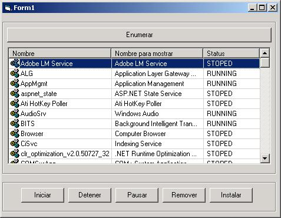

<div align="center">

## Services Manager


</div>

### Description

With this code you can start, stop, pause, install and remove windows services.
 
### More Info
 


<span>             |<span>
---                |---
**Submitted On**   |2007-06-22 13:10:16
**By**             |[Mauricio D&\#237;az](https://github.com/Planet-Source-Code/PSCIndex/blob/master/ByAuthor/mauricio-d-237-az.md)
**Level**          |Intermediate
**User Rating**    |4.0 (8 globes from 2 users)
**Compatibility**  |VB 6\.0
**Category**       |[Windows System Services](https://github.com/Planet-Source-Code/PSCIndex/blob/master/ByCategory/windows-system-services__1-35.md)
**World**          |[Visual Basic](https://github.com/Planet-Source-Code/PSCIndex/blob/master/ByWorld/visual-basic.md)
**Archive File**   |[Services\_M2072006222007\.zip](https://github.com/Planet-Source-Code/mauricio-d-237-az-services-manager__1-68864/archive/master.zip)

### API Declarations

```
Private Const SERVICE_DISABLED As Long = &amp;H4
Private Const SERVICE_DEMAND_START As Long = &amp;H3
Private Const SERVICE_AUTO_START As Long = &amp;H2
Private Const SERVICE_SYSTEM_START As Long = &amp;H1
Private Const SERVICE_BOOT_START As Long = &amp;H0
Private Const SERVICE_WIN32_OWN_PROCESS = &amp;H10&amp;
Private Const SERVICE_WIN32_SHARE_PROCESS = &amp;H20&amp;
Private Const SERVICE_WIN32 = SERVICE_WIN32_OWN_PROCESS + SERVICE_WIN32_SHARE_PROCESS
Private Const SERVICES_ACTIVE_DATABASE = "ServicesActive"
Private Const SERVICE_CONTROL_STOP = &amp;H1
Private Const SERVICE_CONTROL_PAUSE = &amp;H2
Private Const SERVICE_CONTROL_CONTINUE = &amp;H3
Private Const SERVICE_STOPPED = &amp;H1
Private Const SERVICE_START_PENDING = &amp;H2
Private Const SERVICE_STOP_PENDING = &amp;H3
Private Const SERVICE_RUNNING = &amp;H4
Private Const SERVICE_CONTINUE_PENDING = &amp;H5
Private Const SERVICE_PAUSE_PENDING = &amp;H6
Private Const SERVICE_PAUSED = &amp;H7
'Const SERVICE_WIN32 As Long = SERVICE_WIN32_OWN_PROCESS + SERVICE_WIN32_SHARE_PROCESS
Private Const STANDARD_RIGHTS_REQUIRED = &amp;HF0000
Private Const SC_MANAGER_CONNECT = &amp;H1
Private Const SC_MANAGER_CREATE_SERVICE = &amp;H2
Private Const SC_MANAGER_ENUMERATE_SERVICE = &amp;H4
Private Const SC_MANAGER_LOCK = &amp;H8
Private Const SC_MANAGER_QUERY_LOCK_STATUS = &amp;H10
Private Const SC_MANAGER_MODIFY_BOOT_CONFIG = &amp;H20
Private Const SC_MANAGER_ALL_ACCESS = (STANDARD_RIGHTS_REQUIRED Or SC_MANAGER_CONNECT Or SC_MANAGER_CREATE_SERVICE Or SC_MANAGER_ENUMERATE_SERVICE Or SC_MANAGER_LOCK Or SC_MANAGER_QUERY_LOCK_STATUS Or SC_MANAGER_MODIFY_BOOT_CONFIG)
'Private Const SC_MANAGER_ENUMERATE_SERVICE = &amp;H4
Private Const SERVICE_QUERY_CONFIG = &amp;H1
Private Const SERVICE_CHANGE_CONFIG = &amp;H2
Private Const SERVICE_QUERY_STATUS = &amp;H4
Private Const SERVICE_ENUMERATE_DEPENDENTS = &amp;H8
Private Const SERVICE_START = &amp;H10
Private Const SERVICE_STOP = &amp;H20
Private Const SERVICE_PAUSE_CONTINUE = &amp;H40
Private Const SERVICE_INTERROGATE = &amp;H80
Private Const SERVICE_USER_DEFINED_CONTROL = &amp;H100
Private Const SERVICE_ALL_ACCESS = (STANDARD_RIGHTS_REQUIRED Or SERVICE_QUERY_CONFIG Or SERVICE_CHANGE_CONFIG Or SERVICE_QUERY_STATUS Or SERVICE_ENUMERATE_DEPENDENTS Or SERVICE_START Or SERVICE_STOP Or SERVICE_PAUSE_CONTINUE Or SERVICE_INTERROGATE Or SERVICE_USER_DEFINED_CONTROL)
Private Const SERVICE_ACTIVE = &amp;H1
Private Const SERVICE_INACTIVE = &amp;H2
Private Const GENERIC_READ = &amp;H80000000
Private Const ERROR_INSUFFICIENT_BUFFER = 122
Private Const ERROR_SERVICE_ALREADY_RUNNING As Long = 1056&amp;
Private Const ERROR_SERVICE_MARKED_FOR_DELETE As Long = 1072&amp;
Private Const ERROR_SERVICE_EXISTS As Long = 1073&amp;
Private Const ERROR_SERVICE_DATABASE_LOCKED As Long = 1055&amp;
Private Const ERROR_SERVICE_DEPENDENCY_DELETED As Long = 1075&amp;
Private Const ERROR_SERVICE_DEPENDENCY_FAIL As Long = 1068&amp;
Private Const ERROR_SERVICE_DISABLED As Long = 1058&amp;
Private Const ERROR_SERVICE_LOGON_FAILED As Long = 1069&amp;
Private Const ERROR_SERVICE_NO_THREAD As Long = 1054&amp;
Private Const ERROR_SERVICE_REQUEST_TIMEOUT As Long = 1053&amp;
Private Const ERROR_SERVICE_CANNOT_ACCEPT_CTRL As Long = 1061&amp;
Private Const ERROR_SERVICE_NOT_ACTIVE As Long = 1062&amp;
Private Const ERROR_MORE_DATA = 234
Private Const ERROR_INVALID_HANDLE As Long = 6&amp;
Private Const ERROR_INVALID_NAME As Long = 123&amp;
Private Const ERROR_INVALID_PARAMETER As Long = 87
Private Const ERROR_INVALID_SERVICE_ACCOUNT As Long = 1057&amp;
Private Const ERROR_INVALID_SERVICE_CONTROL As Long = 1052&amp;
Private Const ERROR_PATH_NOT_FOUND As Long = 3&amp;
Private Const ERROR_ACCESS_DENIED As Long = 5&amp;
Private Const ERROR_CIRCULAR_DEPENDENCY As Long = 1059&amp;
Private Const ERROR_DUP_NAME As Long = 52&amp;
Private Const ERROR_DEPENDENT_SERVICES_RUNNING As Long = 1051&amp;
Private Const ERROR_SHUTDOWN_IN_PROGRESS As Long = 1115&amp;
Private Type SERVICE_STATUS
  dwServiceType As Long
  dwCurrentState As Long
  dwControlsAccepted As Long
  dwWin32ExitCode As Long
  dwServiceSpecificExitCode As Long
  dwCheckPoint As Long
  dwWaitHint As Long
End Type
Public Enum e_ServiceModeStart
  e_ServiceType_Disabled = 4
  e_ServiceType_Manual = 3
  e_ServiceType_Automatic = 2
  e_ServiceType_SystemStart = 1
  e_ServiceType_BootTime = 0
End Enum
Private Type ENUM_SERVICE_STATUS
  lpServiceName As Long
  lpDisplayName As Long
  ServiceStatus As SERVICE_STATUS
End Type
Private Declare Function CloseServiceHandle Lib "advapi32.dll" (ByVal hSCObject As Long) As Long
Private Declare Function ControlService Lib "advapi32.dll" (ByVal HService As Long, ByVal dwControl As Long, lpServiceStatus As SERVICE_STATUS) As Long
Private Declare Function OpenSCManager Lib "advapi32.dll" Alias "OpenSCManagerA" (ByVal lpMachineName As String, ByVal lpDatabaseName As String, ByVal dwDesiredAccess As Long) As Long
Private Declare Function OpenService Lib "advapi32.dll" Alias "OpenServiceA" (ByVal hSCManager As Long, ByVal lpServiceName As String, ByVal dwDesiredAccess As Long) As Long
Private Declare Function QueryServiceStatus Lib "advapi32.dll" (ByVal HService As Long, lpServiceStatus As SERVICE_STATUS) As Long
Private Declare Function StartService Lib "advapi32.dll" Alias "StartServiceA" (ByVal HService As Long, ByVal dwNumServiceArgs As Long, ByVal lpServiceArgVectors As Long) As Long
Private Declare Function CreateService Lib "advapi32.dll" Alias "CreateServiceA" (ByVal hSCManager As Long, ByVal lpServiceName As String, ByVal lpDisplayName As String, ByVal dwDesiredAccess As Long, ByVal dwServiceType As Long, ByVal dwStartType As Long, ByVal dwErrorControl As Long, ByVal lpBinaryPathName As String, ByVal lpLoadOrderGroup As String, ByVal lpdwTagId As String, ByVal lpDependencies As String, ByVal lp As String, ByVal lpPassword As String) As Long
Private Declare Function DeleteService Lib "advapi32.dll" (ByVal HService As Long) As Long
Private Declare Function GetLastError Lib "kernel32" () As Long
Private Declare Function EnumServicesStatus Lib "advapi32.dll" Alias "EnumServicesStatusA" (ByVal hSCManager As Long, ByVal dwServiceType As Long, ByVal dwServiceState As Long, lpServices As Any, ByVal cbBufSize As Long, pcbBytesNeeded As Long, lpServicesReturned As Long, lpResumeHandle As Long) As Long
Private Declare Function lstrcpy Lib "kernel32.dll" Alias "lstrcpyA" (szDest As String, szcSource As Long) As Long
```


